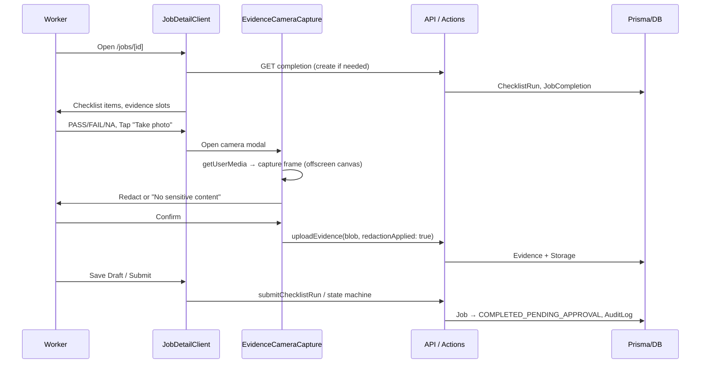
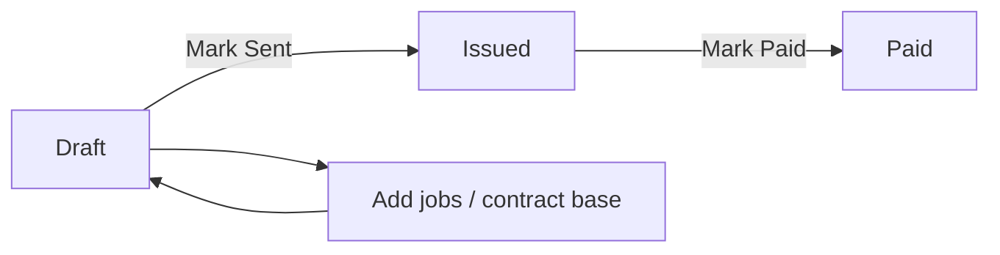

# BLVCKSHELL — In-Depth CTO Report

**Audience:** CTO / Technical leadership  
**Scope:** Full codebase, architecture, workflows, design, stack, file-by-file reference  
**Date:** February 2026  
**Version:** 1.0

---

## Table of Contents

1. [Executive Summary](#1-executive-summary)
2. [Repository Structure & File Tree](#2-repository-structure--file-tree)
3. [Tech Stack & Dependencies](#3-tech-stack--dependencies)
4. [Configuration & Environment](#4-configuration--environment)
5. [Authentication, RBAC & Middleware](#5-authentication-rbac--middleware)
6. [Application Routes & Pages](#6-application-routes--pages)
7. [API Routes](#7-api-routes)
8. [Server Actions & Business Logic](#8-server-actions--business-logic)
9. [Workflows](#9-workflows)
10. [Design System & Web UI](#10-design-system--web-ui)
11. [Database Schema (Overview)](#11-database-schema-overview)
12. [Testing & CI](#12-testing--ci)
13. [File Descriptions (Index)](#13-file-descriptions-index)

---

## 1. Executive Summary

**BLVCKSHELL** is a single Next.js 14 application that serves:

1. **Public marketing site** — Home, services (condo, commercial, light maintenance), contact, lead capture, about, privacy, compliance.
2. **Workforce portal** — Workers and vendor owners view assigned jobs, complete checklists, capture in-app camera evidence (with redaction), submit completions, view earnings.
3. **Admin portal** — Clients/sites, workforce accounts, jobs, invoices, payouts, work orders, incidents, docs (SOPs/checklists).
4. **Client portal** — Client users view their organization’s sites, jobs, and invoices (read-only).

**Single codebase:** Everything lives under `portal/`. Marketing is the route group `(marketing)`; admin under `admin/`; worker under `(worker)`; client under `(client)`. One Vercel deployment with root directory `portal` serves the whole product.

**Key technical choices:** Next.js 14 App Router, TypeScript strict, Prisma 7 + Supabase Postgres, NextAuth 5 (Credentials + JWT), Supabase Storage (evidence/compliance, server-only), Tailwind CSS 4, dark theme (zinc/emerald/gold). State machines enforce Job and WorkOrder transitions; audit logging records state changes; evidence must be captured and redacted in-app (no raw file uploads).

---

## 2. Repository Structure & File Tree

```
blvckshell/
├── .env                          # Root env (shared by portal; not committed)
├── .env.example                  # Template for DATABASE_URL, NEXTAUTH_*, SUPABASE_*, etc.
├── .gitignore
├── .github/
│   └── workflows/
│       └── migrate.yml           # Prisma migrate deploy on push to main (portal/prisma/**)
├── .cursor/
│   └── rules/
│       └── checklist-billing-directive.mdc
├── IMAGES/                       # Marketing/assets (favicon, stock imagery)
│   └── Blvckshell_Favicon.png
├── ops-binder/                   # Operations reference (contracts, SOPs, policies, QA, checklists, state machines)
│   ├── 00_README.md
│   ├── 01_Client_Contract/
│   ├── 02_Subcontractor_Contract/
│   ├── 03_SOPs/
│   ├── 04_Policies/
│   ├── 05_QA_Forms/
│   ├── 06_Checklists_Library/
│   ├── 07_State_Machines_and_Roles/
│   └── 08_Sales_Enablement/
├── portal/                       # Next.js app (marketing + admin + worker + client)
│   ├── .env.example
│   ├── next.config.js
│   ├── next-env.d.ts
│   ├── package.json
│   ├── package-lock.json
│   ├── playwright.config.ts
│   ├── postcss.config.js
│   ├── prisma.config.ts          # Prisma 7: url/directUrl from env
│   ├── tailwind.config.ts
│   ├── tsconfig.json
│   ├── vercel.json
│   ├── vitest.config.ts
│   ├── k6.config.js
│   ├── content/
│   │   └── docs/
│   │       ├── checklists/       # CL_01–CL_08 markdown
│   │       └── sops/             # SOP_01–SOP_06 markdown
│   ├── docs/                     # Internal dev docs (Category A, Prisma policy)
│   ├── prisma/
│   │   ├── schema.prisma         # Full data model (~780 lines)
│   │   ├── seed.ts
│   │   ├── migrations/
│   │   └── raw_production_constraints.sql
│   └── src/
│       ├── app/
│       │   ├── layout.tsx        # Root layout
│       │   ├── globals.css        # Tailwind + CSS variables (theme)
│       │   ├── (marketing)/       # Public pages
│       │   ├── (client)/          # Client portal
│       │   ├── (worker)/          # Worker/vendor portal
│       │   ├── admin/             # Admin app
│       │   ├── api/               # API routes
│       │   ├── login/
│       │   └── portal/            # Role-based redirect
│       ├── components/
│       ├── lib/
│       ├── server/
│       └── __tests__/
├── README.md                     # Project overview, quick links, execution order
├── ROADMAP.md
├── DECISIONS.md
├── SCHEMA_RECONCILIATION_PLAN.md
├── COMPREHENSIVE_PROGRAM_REPORT.md
└── [other .md docs]
```

### Portal `src/` detail

```
portal/src/
├── app/
│   ├── (marketing)/
│   │   ├── layout.tsx
│   │   ├── page.tsx              # Home
│   │   ├── about/
│   │   ├── commercial-cleaning/
│   │   ├── condo-cleaning/
│   │   ├── contact/               # ContactForm, lead API
│   │   ├── light-maintenance/
│   │   ├── pilots/
│   │   ├── privacy/
│   │   ├── services/
│   │   └── compliance/
│   ├── (client)/
│   │   ├── layout.tsx            # requireClient, ClientNav
│   │   └── client/
│   │       ├── page.tsx
│   │       ├── invoices/         # List, [id] detail + PDF
│   │       ├── jobs/             # List, [id] detail
│   │       └── sites/
│   ├── (worker)/
│   │   ├── layout.tsx            # requireWorker, WorkerNav
│   │   ├── jobs/                 # List, [id] JobDetailClient (checklist + evidence)
│   │   ├── profile/
│   │   ├── earnings/
│   │   └── vendor/               # jobs, team, earnings (VENDOR_OWNER)
│   ├── admin/
│   │   ├── layout.tsx            # requireAdmin, AdminNav
│   │   ├── page.tsx              # → /admin/jobs
│   │   ├── clients/              # List, new, [id] + ChecklistManager
│   │   ├── workforce/           # List, new, [id]
│   │   ├── jobs/                 # List, new, [id]
│   │   ├── invoices/             # List, new, [id]
│   │   ├── payouts/              # List, batch/[id]
│   │   ├── workorders/
│   │   ├── incidents/
│   │   ├── audit/
│   │   └── docs/                 # SOPs, checklists by slug
│   ├── api/
│   │   ├── auth/[...nextauth]/
│   │   ├── health/
│   │   ├── lead/
│   │   ├── evidence/             # [id] GET, upload POST
│   │   ├── jobs/[id]/completion/
│   │   ├── admin/jobs/[id]/cancel/
│   │   ├── invoices/[id]/pdf/
│   │   └── payouts/batch/[id]/statement/
│   ├── login/
│   └── portal/
├── components/
│   ├── EvidenceCameraCapture.tsx # In-app camera, capture, redaction, onDone(blob)
│   ├── JobDetailClient.tsx       # Worker job UI: checklist, evidence, Take photo, Submit
│   ├── admin/                    # AdminNav, JobAdminActions, bulk panels, etc.
│   ├── client/                   # ClientNav
│   ├── worker/                   # WorkerNav
│   ├── marketing/               # Header, Footer, ProcessFlow, PremiumTile, etc.
│   ├── forms/                   # LoginForm
│   ├── animations/               # PageTransition, ScrollReveal, StaggerContainer
│   └── providers/                # MotionProvider
├── lib/
│   ├── auth.ts                  # NextAuth config (Credentials, JWT)
│   ├── prisma.ts                # Prisma singleton
│   ├── storage.ts               # Supabase Storage (evidence path, validation)
│   ├── validations.ts           # Zod schemas
│   ├── state-machine.ts         # Job/WorkOrder transitions + AuditLog
│   ├── checklist-parser.ts      # Markdown → checklist items
│   ├── docs.ts                  # Load markdown from content/docs
│   ├── lead-schema.ts           # Lead form Zod + honeypot
│   ├── rate-limit.ts            # In-memory rate limit (auth, lead, upload)
│   └── animations.ts
├── server/
│   ├── guards/
│   │   └── rbac.ts              # getCurrentUser, requireAdmin, requireWorker, canAccessJob, etc.
│   ├── actions/                 # invoice-actions, job-actions, upload-actions, etc.
│   ├── bulk-actions/            # jobs, invoices, work-orders, incidents
│   └── automation/              # createMakeGoodJobIfNeeded, ensureJobOnDraftInvoice, flagOverdueApprovals
└── __tests__/                   # Unit, integration, e2e, load (k6)
```

---

## 3. Tech Stack & Dependencies

| Layer | Technology |
|-------|------------|
| **Runtime** | Node.js 20 LTS |
| **Framework** | Next.js 14.x (App Router) |
| **Language** | TypeScript (strict) |
| **Database** | PostgreSQL (Supabase); Prisma 7 ORM |
| **Auth** | NextAuth 5 (beta), Credentials provider, JWT, 24h session |
| **Storage** | Supabase Storage (evidence, compliance); server-only |
| **Styling** | Tailwind CSS 4 |
| **Forms** | React Hook Form, Zod (client + server) |
| **PDF** | pdfkit (invoice PDF, pay statement PDF) |
| **Deploy** | Vercel (root directory = `portal`) |

### Production dependencies (portal/package.json)

| Package | Version | Purpose |
|---------|---------|---------|
| next | ^14.2.35 | App Router, RSC, API routes |
| react, react-dom | ^18.3.1 | UI |
| @prisma/client | ^7.4.0 | ORM |
| @prisma/adapter-pg | ^7.4.0 | Prisma + pg driver |
| pg | ^8.18.0 | PostgreSQL driver |
| next-auth | ^5.0.0-beta.30 | Auth (Credentials, JWT) |
| @supabase/supabase-js | ^2.95.3 | Storage client |
| bcryptjs | ^3.0.3 | Password hashing |
| zod | ^4.3.6 | Validation |
| react-hook-form | ^7.71.1 | Forms |
| @hookform/resolvers | ^5.2.2 | Zod + RHF |
| tailwindcss | ^4.1.18 | Styling |
| framer-motion | ^11.11.17 | Animations |
| pdfkit | ^0.17.2 | PDF generation |
| react-markdown, remark-gfm | ^10.1.0, ^4.0.1 | Markdown (docs) |

### Dev dependencies

| Package | Purpose |
|---------|---------|
| prisma | Migrations, generate |
| typescript, @types/* | Types |
| vitest, @vitest/* | Unit/integration tests |
| @playwright/test | E2E |
| dotenv, tsx | Env, seed/scripts |

---

## 4. Configuration & Environment

- **Env file:** Root `.env` (and/or `portal/.env`). Portal loads `../.env` via `next.config.js` and `prisma.config.ts`.
- **Required vars:** `DATABASE_URL` (pooled), `DIRECT_URL` (migrations; optional in CI), `NEXTAUTH_SECRET`, `NEXTAUTH_URL`, `NEXT_PUBLIC_SUPABASE_URL`, `SUPABASE_SERVICE_ROLE_KEY`.
- **Prisma:** `prisma.config.ts` sets `url: process.env.DATABASE_URL`, `directUrl: process.env.DIRECT_URL`. Schema has no inline url (Prisma 7).
- **Next.js:** `next.config.js` — images remotePatterns, serverActions bodySizeLimit, serverComponentsExternalPackages: `['pdfkit']`, redirects for /services/*.
- **Vercel:** Root directory = `portal`. Same env vars in project/environment.

---

## 5. Authentication, RBAC & Middleware

- **NextAuth** (`lib/auth.ts`): Credentials provider; lookup User by email, bcrypt compare; JWT with `id`, `role`, `workforceAccountId`, `workerId`, `clientOrganizationId`. Session 24h.
- **Guards** (`server/guards/rbac.ts`): `getCurrentUser`, `requireAuth`, `requireAdmin`, `requireClient`, `requireWorker`, `requireVendorOwner`, `canAccessJob`, `canAccessInvoice`, `canAccessWorkforceAccount`. Used in layouts and server actions.
- **Middleware** (`middleware.ts`): Rate limiting only (no route protection here to avoid Edge getToken issues). Limits: `/api/auth/*` 5 req/15min, `/api/lead` and `/api/evidence/upload` 10 req/15min per IP.

---

## 6. Application Routes & Pages

(See Table of Contents; section 2 file tree and COMPREHENSIVE_PROGRAM_REPORT.md §4.1 list every route and file. Summary: marketing = public; /login, /portal; admin = requireAdmin; (worker) = requireWorker; (client) = requireClient.)

---

## 7. API Routes

| Method | Path | Purpose |
|--------|------|---------|
| * | /api/auth/[...nextauth] | NextAuth handlers |
| GET | /api/health | Health check |
| POST | /api/lead | Lead form (Zod, honeypot); public |
| GET | /api/evidence/[id] | Serve evidence image (auth + canAccessJob) |
| POST | /api/evidence/upload | Upload evidence (worker; redactionApplied required) |
| GET | /api/jobs/[id]/completion | Get/create completion ID |
| POST | /api/admin/jobs/[id]/cancel | Cancel job (admin) |
| GET | /api/invoices/[id]/pdf | Invoice PDF (admin/client by canAccessInvoice) |
| GET | /api/payouts/batch/[id]/statement | Pay statement PDF (admin; ?workforceAccountId=) |

---

## 8. Server Actions & Business Logic

- **invoice-actions.ts:** getUninvoicedApprovedJobs, createDraftInvoice, getInvoiceWithDetails, addJobToInvoice, removeJobFromInvoice, addBillingAdjustment, listInvoices, updateInvoiceStatus, addContractBaseToInvoice.
- **checklist-run-actions.ts:** createOrGetChecklistRun, saveChecklistRunItem, submitChecklistRun (requireWorker).
- **job-actions.ts:** saveDraft, submitCompletion (worker); job CRUD via admin.
- **upload-actions.ts:** uploadEvidence (requireWorker; enforces redactionApplied).
- **payout-actions.ts:** createPayoutBatch, markPayoutBatchPaid (requireAdmin).
- **bulk-actions:** jobs, invoices, work-orders, incidents (admin).
- **automation:** createMakeGoodJobIfNeeded, ensureJobOnDraftInvoice, flagOverdueApprovals.

---

## 9. Workflows

### Job lifecycle (worker)



1. Worker sees assigned jobs at `/jobs`; opens job at `/jobs/[id]`.
2. JobDetailClient loads checklist (from site’s active ChecklistTemplate), creates/loads ChecklistRun and JobCompletion.
3. Worker marks items PASS/FAIL/NA; per-item or run-level photo via “Take photo” → EvidenceCameraCapture (getUserMedia → capture → redact or “No sensitive content”) → blob passed to upload action with `redactionApplied: true`.
4. Save Draft persists checklist run and completion; Submit calls state machine (PendingApproval), then admin approves/rejects at `/admin/jobs/[id]`.

### Invoice workflow (admin)



1. Admin creates draft invoice (client + period) at `/admin/invoices/new`.
2. Add jobs (from approved, uninvoiced) and/or contract base; line items and adjustments built from jobs + BillingAdjustments.
3. Mark Sent → Issued; Mark Paid → Paid. PDF at `/api/invoices/[id]/pdf`.

### Payout workflow (admin)

1. Unpaid approved jobs grouped by period; admin creates payout batch (period).
2. Batch detail shows pay lines per worker; Mark batch paid updates job payout status. Pay statement PDF per workforce account.

### Client portal

Client users (role CLIENT) see only their organization’s sites, jobs, invoices (read-only); can download invoice PDF via same API with canAccessInvoice.

---

## 10. Design System & Web UI

### Global

- **globals.css:** `@import "tailwindcss"`; CSS variables: `--background: #0a0a0a`, `--foreground: #fafafa`, full zinc scale (50–950), accent gold (#d4af37), accent-secondary emerald (#10b981). Spacing scale (--space-1 through --space-24). `prefers-reduced-motion` respected (animations/transitions reduced to 0.01ms). Utilities: .text-display, .text-balance.
- **Tailwind:** content from `src/app`, `src/components`, `src/pages`. theme.extend colors background/foreground from CSS vars. No design-tokens file; tap targets (e.g. 56px) are inline.

### Marketing

- **Layout:** (marketing)/layout wraps children with marketing chrome. Header (nav, Portal link), Footer (links, legal), MotionProvider for Framer Motion.
- **Components:** Header, Footer, ProcessFlow (steps/flow), PremiumTile (service cards), ImageTreatment (images). Dark theme; luxury typography.
- **Pages:** Home (hero, services, value props); /services overview; /condo-cleaning, /commercial-cleaning, /light-maintenance (service copy + CTAs); /contact (ContactForm → /api/lead); /about, /privacy, /compliance, /pilots.

### Admin

- **Layout:** admin/layout calls requireAdmin(); AdminNav (Locations, Workforce, Jobs, Invoices, Work Orders, Incidents, Payouts, Docs). Dark zinc/emerald; tables and cards; consistent borders (border-zinc-800), spacing.
- **Patterns:** List pages (clients, workforce, jobs, invoices, payouts, workorders, incidents); detail pages with action panels (e.g. JobAdminActions, InvoiceDraftActions); bulk panels (BulkJobActionsPanel, BulkGenerateDraftsPanel, etc.).

### Worker

- **Layout:** (worker)/layout calls requireWorker(); WorkerNav (Jobs, Profile, Earnings, Vendor for owners). Same dark theme.
- **Job detail:** JobDetailClient — checklist with large tap targets (min-h-52/56), progress %, blocking reasons panel; “Take photo” opens full-screen EvidenceCameraCapture modal (camera → capture → redact → upload). Save Draft / Submit sticky at bottom.

### Client

- **Layout:** (client)/layout calls requireClient(); ClientNav. Read-only views; invoice PDF download via same API with canAccessInvoice.

---

## 11. Database Schema (Overview)

**Prisma models (portal/prisma/schema.prisma):**

| Model | Purpose |
|-------|---------|
| ClientOrganization | Client company; primary contact, sites, contracts, invoices |
| ClientContact | Additional contacts per client |
| WorkforceAccount | Vendor or internal; workers, jobs, payouts, compliance |
| User | Login; role (ADMIN, CLIENT, VENDOR_OWNER, VENDOR_WORKER, INTERNAL_WORKER); links to Worker, WorkforceAccount, or ClientOrganization |
| Worker | Links User to WorkforceAccount; assigned jobs, checklist runs, completions |
| ComplianceDocument | COI, WSIB, etc.; linked to WorkforceAccount |
| Site | Location under ClientOrganization; checklist templates, contracts, jobs |
| SiteAssignment | WorkforceAccount allowed at Site |
| AccessCredential | Site access (keys, codes) |
| ChecklistTemplate | Per-site checklist definition; versioned; one active per site (partial index) |
| ChecklistRun | One per job completion attempt; status; items |
| ChecklistRunItem | Per-item result (PASS/FAIL/NA); optional evidence link |
| SiteTemplate, JobTemplate, ContractTemplate, InvoiceTemplate, MakeGoodRuleTemplate | Category A template entities; snapshot FKs on Site, Job, Contract, Invoice |
| Job | Assigned to WorkforceAccount/Worker; status (state machine); site, contract |
| JobCompletion | Tracks completion; links to ChecklistRun and evidence |
| Evidence | Photo evidence; Storage path; linked to run/item or completion; redactionApplied |
| WorkOrder | State machine; links to Job, WorkforceAccount |
| IncidentReport | Incidents; type, status |
| PayoutBatch | Period; status (Draft, Paid) |
| PayoutLine | Job-level line in batch; workforceAccountId, amount |
| Contract | Client/Site; billing cadence; status |
| Invoice | Client; period; line items, adjustments; status (Draft, Issued, Paid) |
| InvoiceLineItem | From job or contract base; site, amount |
| BillingAdjustment | Charge/Credit; status (Proposed, Approved, Applied) |
| AuditLog | State change log (entity, from/to, actor) |
| Lead | Marketing lead (name, email, message, sourcePage, honeypot) |

- **State machines:** Job (Draft → Scheduled → InProgress → PendingApproval → Approved/Rejected), WorkOrder (draft → sent → accepted, etc.). All transitions in state-machine.ts with AuditLog.
- **Evidence:** Linked to ChecklistRunItem or JobCompletion; stored in Supabase Storage; upload requires redactionApplied.
- **Templates (Category A):** SiteTemplate, JobTemplate, ContractTemplate, InvoiceTemplate, MakeGoodRuleTemplate; snapshot columns on Site, Job, Contract, Invoice.

Full schema: `portal/prisma/schema.prisma` (~779 lines). Migrations: `portal/prisma/migrations/`. No `db push` in production; use migrate deploy only. Schema vs DB verification: `npm run db:verify` (CI runs after deploy).

---

## 12. Testing & CI

- **Unit:** Vitest (state-machine, RBAC, actions, bulk-actions).
- **Integration:** API tests (evidence, lead).
- **E2E:** Playwright (admin invoice workflow, worker job completion).
- **Load:** k6 (mixed-workload, worker-workflow, peak-load).
- **CI:** `.github/workflows/migrate.yml` — on push to main (portal/prisma/** or prisma.config.ts), runs migrate deploy (pooler, PRISMA_SCHEMA_DISABLE_ADVISORY_LOCK), then db:verify (schema vs DB diff).

---

## 13. File Descriptions (Index)

### Root & config

| File | Description |
|------|-------------|
| portal/src/app/layout.tsx | Root layout; metadata (title, favicon); globals.css; html/body |
| portal/src/app/globals.css | Tailwind import; CSS variables (--background, --foreground, zinc, accent gold/emerald); reduced-motion media query; .text-display etc. |
| portal/src/middleware.ts | Rate limit only: /api/auth 5/15min, /api/lead and /api/evidence/upload 10/15min per IP; no route protection (guards in layouts) |
| portal/next.config.js | reactStrictMode; images remotePatterns (Unsplash); serverActions bodySizeLimit 10mb; serverComponentsExternalPackages pdfkit; redirects /services/* → /condo-cleaning etc. |
| portal/prisma.config.ts | Prisma 7: schema path, migrations path, datasource url/directUrl from env (dotenv from root .env) |
| portal/tailwind.config.ts | content paths; theme extend background/foreground from CSS vars |
| portal/tsconfig.json | TypeScript strict; paths @/* → src/* |

### Auth & RBAC

| File | Description |
|------|-------------|
| portal/src/lib/auth.ts | NextAuth: Credentials provider (email/password, Prisma User, bcrypt); JWT 24h; callbacks for role, workforceAccountId, workerId, clientOrganizationId |
| portal/src/server/guards/rbac.ts | getCurrentUser, requireAuth, requireAdmin, requireClient, requireWorker, requireVendorOwner, canAccessJob, canAccessInvoice, canAccessWorkforceAccount (Prisma checks by role) |
| portal/src/app/api/auth/[...nextauth]/route.ts | Exports NextAuth handlers |
| portal/src/components/forms/LoginForm.tsx | Email/password form; signIn; error display |
| portal/src/app/login/page.tsx | Login page; LoginForm |
| portal/src/app/portal/page.tsx | Role-based redirect: ADMIN → /admin, CLIENT → /client, else → /jobs |

### Data & storage

| File | Description |
|------|-------------|
| portal/src/lib/prisma.ts | Prisma client singleton (Prisma 7; adapter pg in production) |
| portal/src/lib/storage.ts | Supabase client (service role); evidence path; file type/size validation; MAX_PHOTOS_PER_JOB |
| portal/src/lib/state-machine.ts | Job and WorkOrder state transitions; canTransition*, transition*; AuditLog writes |
| portal/src/lib/validations.ts | Zod schemas: login, job completion, file upload, workforce, site, job, etc. |
| portal/prisma/schema.prisma | Full data model; ~779 lines; 30+ models; partialIndexes preview |

### Worker & evidence

| File | Description |
|------|-------------|
| portal/src/components/JobDetailClient.tsx | Worker job detail: checklist items (PASS/FAIL/NA), per-item and run-level evidence, “Take photo” opens camera; Save Draft / Submit; blocking reasons panel; uses checklist-run-actions, upload-actions |
| portal/src/components/EvidenceCameraCapture.tsx | Full-screen modal: getUserMedia (environment), offscreen canvas capture; step camera → redact; draw rects or “No sensitive content”; confirmAndUpload → onDone(blob, redactionType); retake |
| portal/src/app/(worker)/jobs/page.tsx | Worker job list (requireWorker) |
| portal/src/app/(worker)/jobs/[id]/page.tsx | Renders JobDetailClient with job id |
| portal/src/server/actions/checklist-run-actions.ts | createOrGetChecklistRun, saveChecklistRunItem, submitChecklistRun (requireWorker) |
| portal/src/server/actions/upload-actions.ts | uploadEvidence (requireWorker; enforces redactionApplied; Storage upload) |
| portal/src/app/api/evidence/upload/route.ts | POST; auth + canAccessJob; rejects without redactionApplied |
| portal/src/app/api/evidence/[id]/route.ts | GET; serve image; auth + canAccessJob |
| portal/src/app/api/jobs/[id]/completion/route.ts | GET; create or return JobCompletion ID |

### Admin

| File | Description |
|------|-------------|
| portal/src/app/admin/layout.tsx | requireAdmin; AdminNav |
| portal/src/components/admin/AdminNav.tsx | Nav: Locations, Workforce, Jobs, Invoices, Work Orders, Incidents, Payouts, Docs |
| portal/src/components/admin/JobAdminActions.tsx | Approve / Reject / Cancel job (state machine) |
| portal/src/app/admin/jobs/page.tsx | Jobs list; filters; bulk actions |
| portal/src/app/admin/jobs/[id]/page.tsx | Job detail; run/evidence; JobAdminActions |
| portal/src/app/admin/invoices/[id]/page.tsx | Invoice detail; line items; InvoiceDraftActions, InvoiceStatusActions, AddContractBaseButton; PDF link |
| portal/src/app/api/invoices/[id]/pdf/route.ts | GET; canAccessInvoice; PDFKit; buffer; Content-Disposition |
| portal/src/app/api/admin/jobs/[id]/cancel/route.ts | POST; requireAdmin; cancel job |
| portal/src/server/actions/invoice-actions.ts | createDraftInvoice, addJobToInvoice, addContractBaseToInvoice, updateInvoiceStatus, etc. |
| portal/src/server/actions/payout-actions.ts | createPayoutBatch, markPayoutBatchPaid |
| portal/src/app/api/payouts/batch/[id]/statement/route.ts | GET; pay statement PDF (admin; workforceAccountId query) |

### Client portal

| File | Description |
|------|-------------|
| portal/src/app/(client)/layout.tsx | requireClient; ClientNav |
| portal/src/app/(client)/client/invoices/[id]/page.tsx | Invoice detail; PDF link (canAccessInvoice) |
| portal/src/app/(client)/client/jobs/[id]/page.tsx | Job detail (read-only) |

### Marketing

| File | Description |
|------|-------------|
| portal/src/app/(marketing)/layout.tsx | Marketing layout (Header, Footer, MotionProvider) |
| portal/src/app/(marketing)/page.tsx | Home; hero; services; value props |
| portal/src/app/(marketing)/contact/page.tsx | Contact form; ContactForm → POST /api/lead |
| portal/src/components/marketing/Header.tsx | Site header; nav; Portal link |
| portal/src/components/marketing/Footer.tsx | Footer; links; legal |
| portal/src/app/api/lead/route.ts | POST; Zod + honeypot; Lead create |

### Content & docs

| File | Description |
|------|-------------|
| portal/src/lib/checklist-parser.ts | Parse checklist markdown → items (itemId, label, required, photoRequired, photoPointLabel) |
| portal/src/lib/docs.ts | Load markdown from content/docs (SOPs, checklists) |
| portal/content/docs/checklists/ | CL_01–CL_08 markdown |
| portal/content/docs/sops/ | SOP_01–SOP_06 markdown |
| portal/src/app/admin/docs/page.tsx | Docs index; links to sops/[slug], checklists/[slug] |

### Testing

| File | Description |
|------|-------------|
| portal/vitest.config.ts | Vitest; setup; coverage |
| portal/playwright.config.ts | Playwright; baseURL localhost:3000 |
| portal/src/__tests__/unit/state-machine/pure-transitions.test.ts | Job transition rules |
| portal/src/__tests__/unit/guards/rbac.test.ts | canAccessJob, etc. |
| portal/src/__tests__/e2e/ | admin invoice-workflow, worker job-completion |
| portal/src/__tests__/load/*.js | k6 load scripts |

(Additional files are described implicitly by the file tree and route/action tables above.)

---

**End of report.** For execution and task breakdown, see ROADMAP.md and IMPLEMENTATION_PLAN.md. For schema reconciliation and migrate runbook, see SCHEMA_RECONCILIATION_PLAN.md.
